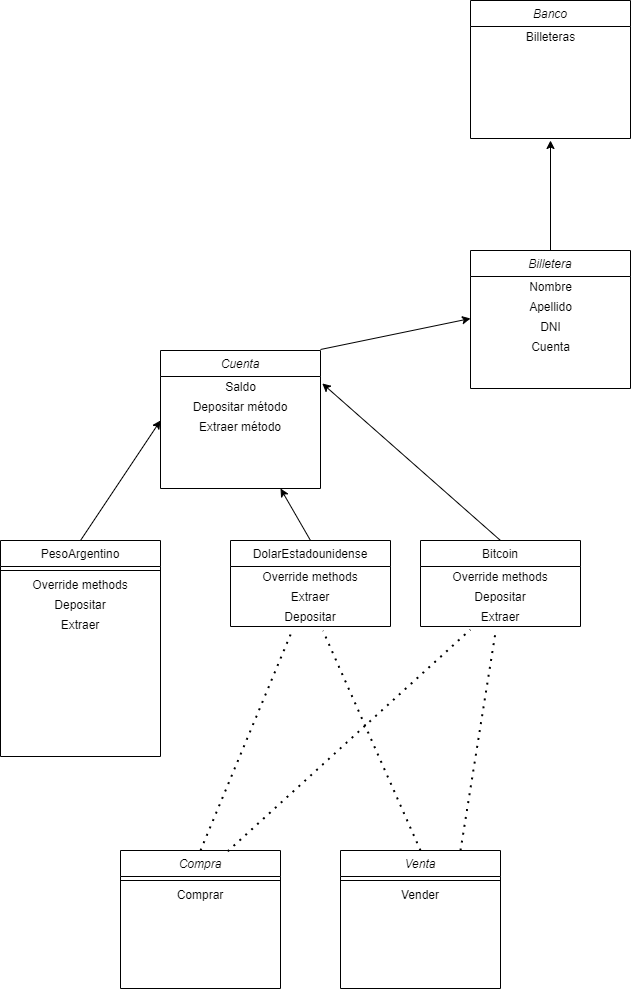

# Billetera Unificada - Banco Central de la República Argentina

#### Integrantes
* Rodrigo Monteagudo
* Tomás Aranda
* Hernán Albornoz
* Martín Mariano Arias

#### Caso de uso
El Banco Central de la República Argentina, necesita de un nuevo software para incentivar a los distintos perfiles de inversores a centralizar sus criptomonedas y las monedas fíat en un mismo lugar. Esto tiene como objetivo lograr una mayor trazabilidad sobre los ingresos de los mismos, como así también la compra de las mismas.

#### Propuesta por parte del banco
Para lograr una mejor adopción, propone lo siguiente:
<ul>
	<li><b>Pesos argentinos</b></li>
	<ul>
		<li>Por cada depósito en moneda local (ARS), ofrece un interés del 3% por cada transacción mayor a $10.000.
</li>
		<li>Las extracciones no tienen costo alguno.</li>
	</ul>
	<li><b>Dólares estadounidenses</b></li>
	<ul>
		<li>Por cada depósito en USD, ofrece un interés del 5%.</li>
		<li>Las extracciones no tienen costo alguno.</li>
		<li>Para la compra, el cepo al dólar por decreto (U$D 200 mensuales) se extiende a la compra mensual de U$D 1.000.</li>
		<ul>
			<li><b>La compra de dólares sólo puede hacerse con Pesos Argentinos.</b></li>
		</ul>
		<li>Para la venta, no hay restricciones</li>
		<ul>
			<li><b>Se depositará en tu cuenta de Pesos Argentinos el valor según la cotización.</b></li>
		</ul>
	</ul>
<b>(El Banco tomará como referencia el valor de $185 para la compra/venta de dólares.)</b>
	<li><b>Bitcoin</b></li>
	<ul>
		<li>Actualmente la blockchain de Bitcoin tiene un fee de BTC 0,015 por transacción. El banco cubrirá dicho fee, incentivando a centralizar los depósitos y las compras dentro de la misma.</li>
		<ul><li>El monto mínimo de compra debe ser mayor al fee de la blockchain (BTC 0,015).</li></ul>
		<li>Para las extracciones, multiplicará el fee base de la blockchain (BTC 0.015 x 2) con el fin de retener los capitales y que los mismos no se fuguen hacia otras Wallets competidoras.</li>
		<li>Para la venta, no se aplican restricciones.</li>
		<ul><li><b>Se depositará en tu cuenta de Pesos Argentinos el valor según la cotización.</b></li></ul>
	</ul>
</ul>

#### Diagrama

